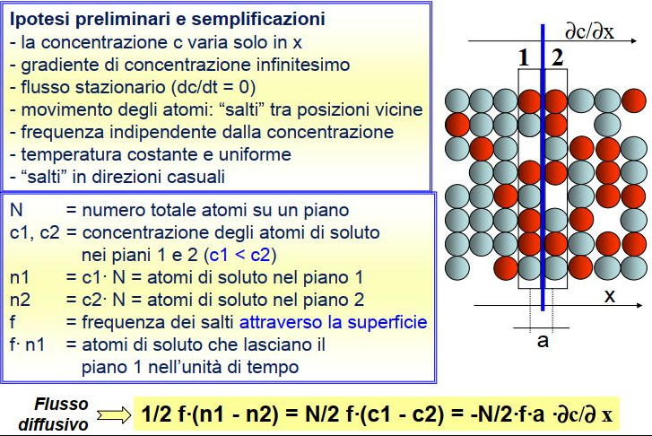

# DIFFUSIONE ALLO STATO SOLIDO

Trasporto di materiale per movimento atomico, di massa, all'interno di un determinato solido. Le grandezze che permettono di caratterizzare e definire la mobilità atomica sono:
- temperatura
- velocità <--- dimensione degli atomi e temperatura
- fluttuazioni energetiche: l'energia associata alla vibrazione atomica può essere incrementata a causa di variazioni temporanee di temperatura, bombardamento tramite raggi ionici o fotoni, tali incremento può essere tale ad allontanare uno ione metalico dalla sua posizione reticolare incrementando la mobiltà atomica
- movimenti casuali
- natura statistica

Tale fenomeno di diffusione atomica può essere dimostrato tramite un approccio empirico interponendo una lamina di Cesio a 2 lamine di Boro. Si avrà che con il tempo avviene un meccanismo di interdiffusione; autodiffusione nel caso di el dello stesso tipo.

La temperatura è uno dei fattori primari che regolano la mobilità atomica e altrettanto importante è la bariera cinetica ovvero l'energia di attivazione necessaria a spostare gli atomi tenuti assieme della forza di coesione cosa possibile solo per la presenza di difetti reticolari.

I fenomeni di diffusione sono differenti:
- volumetrica
  * lacunare
  * interstiziale
  * scambio diretto
  * scambio ciclico
  * indiretto interstiziale e autointerstiziale
- diffusione a bordo grano
- superficiale
- lungo le dislocazioni

## Leggi di Fick

Prendono in considerazioni 4 varibili: temperatura, concentrazione, posizione, tempo

#### 1° Legge di Fick

Un primo tipo di problema che deve essere valutato è la velocità con cui avviene, a regime, il processo diffusivo di una specie chimica attraverso un'altra o, che è lo stesso, quanto velocemente migra una data specie chimica da una zona a maggiore concentrazione C1 verso una zona a minore concentrazione C2 .
Il fenomeno descritto è detto flusso di diffusione e viene indicato con la lettera J ; l'unità di misura è [atomi/m2∙s]. J rappresenta la quantità di atomi che, in modo costante, attraversano perpendicolarmente una superficie A di spessore x nell'unità di tempo t.

La prima legge di Fick è valida solo quando si abbiano fenomeni di diffusione in regime stazionario, ossia in condizioni in cui il gradiente della concentrazione C si mantiene inalterato nel tempo (J costante).

Q è l'energia di attivazione che permette di muovere una mole di sostanza.
Una bassa energia di attivazione indica una diffusione facilitata.
Energia di attivazione è più bassa per:
- atomi che diffondono attraverso strutture cristalline con bassi fattori di impilaggio, meno compatte.
- materiali con T fusione minore
- atomi sostituzionali di piccole dimensioni rispetto ad atomi di dimensioni maggiori.

#### 2° Legge di Fick
Permette di calcolare la concentrazione di una specie diffondente vicino alla superficie del materiale in funzione del t e della sistanza purchè D rimanga costante e le concentrazioni degli atomi che diffondono sulla superficie invariati.
In un regime non stazionario si deve quindi considerare il tempo. Si ottiene un equazione differenziale definibile solo quando sono definite le condizioni al contorno. E si deve avere:
- tutti gli atomi del soluto sono uniformemente distribuiti nel solido
- x iniziale è 0
- tempo iniziale quello di inizio del processo

## Esempi Applicativi
* Ingrossamento della grana
* Carbocementazione
* Sinterizzazione
* Diffusion Bolding
