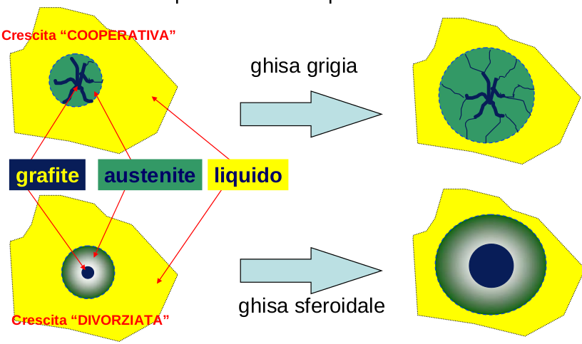
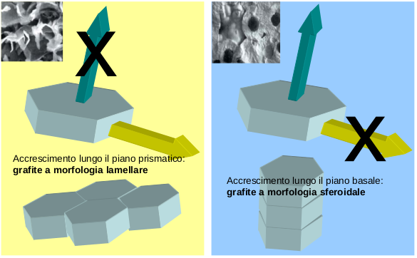

# NUCLEAZIONE
La grafite: nucleazione eterogenea
- da particelle presenti naturalmente nel bagno fuso:
CaO, Al 2 O 3 , MgO, CaS, SiO 2 , Mg 3 N 2 , MgS, SiC, CaC
- particelle formatesi durante le fasi del processo
- particelle aggiunte nel bagno come specifici inoculanti
- una combinazione dei punti sopra citati

# ACCRESCIMENTO
Le differenze microstrutturali tra ghise sferoidali e grigie si originano proprio in questa fase. In  sostanza,  una  volta  formati  i  primi  nuclei,  questi  iniziano  ad  accrescersi;  in  maniera  semplificata,  si  può  dire  che  l’accrescimento  non  è  altro  che  l’espansione  dei  nuclei  formati  a  scapito  del  liquido  presente.  I  nuclei  formati  sono  costituiti,  come  è  stato  verificato da diversi ricercatori, da austenite e grafite. Si è infatti osservato che un nucleo eutettico  di  ghisa  lamellare  è  costituito  da  lamelle  di  grafite  interconnesse,  che  si  originano  al  centro  del  nucleo,  incorporate  in  una  “matrice”  di  austenite;  un  nucleo  euetettico   di   ghisa   sferoidale   è   invece   formato   (da   un   certo   punto   in   poi   della   solidificazione) da un nodulo centrale di grafite circondato da un “guscio” austenitico. Gli   atomi   che   dalla   fase   liquida   passano   a   quella   solida   devono   “selettivamente”   accrescere  l’austenite  o  la  grafite.  In  pratica,  il  carbonio  andrà  prevalentemente  ad  accrescere  la  grafite  (lamellare  o  sferoidale),  mentre  gli  atomi  di  ferro  e  degli  altri  elementi   in   lega   (compresa   una   certa   quota   di   carbonio)   dovranno   determinare   l’accrescimento dell’austenite. Le modalità con cui questo avviene sono però decisamente diverse, così come schematicamente illustrato in Figura. 

L'accrescimento in una direzione aumenta con il grado di impacchettamento del piano che ha in tale direzione. 

#### Ghise grigie

**“accrescimento cooperativo”**: l’accrescimento del solido eutettico avviene mediante l’accrescimento contemporaneo delle lamelle di grafite (mediante  il  C  presente  nel  liquido)  e  del  grano  austenitico  (mediante  il  Fe,  gli  altri  elementi  in  lega  e  il  Carbonio  solubile  nell’austenite). 

#### Ghise sferoidali
La  solidificazione  eutettica  di  queste  ghise  inizia  con  la  formazione,  in  zone  differenti,  di  noduli  di  grafite  e  di  dendriti  austenitiche.  Da  un  certo  punto  in  poi  (in  pratica  da  quando  i  noduli  hanno  raggiunto  un  diametro  critico  di  poco  superiore  ai  10  μm),  si  ha  la  presenza  di  sferoidi  grafitici  circondati  da  un  “guscio”  austenitico.  L’accrescimento  procede  contemporaneamente  nello  sferoide centrale di grafite e nel guscio austenitico. E’ chiaro però che l’accrescimento della grafite richiede  necessariamente  una  preventiva  diffusione  del  Carbonio  attraverso  il  guscio  austenitico. Si tratta del cosiddetto **“accrescimento divorziato”**: il Carbonio si separa dalla ghisa  liquida  per  diffondere  attraverso  l’austenite  e  andare  ad  ingrossare  lo  sferoide  di  grafite. In  sostanza,  nella  relazione  che  descrive  l’accrescimento,  deve  comparire  un  termine  legato alla diffusività del Carbonio nell’austenite. Man mano che il processo avanza, viene rallentato  dal  fatto  che  la  distanza  che  dev’essere  percorsa  dal  Carbonio  aumenta. 

#### Ghise compatte o lamellari o vermiculari

L’appellativo “vermiculare” è riferito alla forma della grafite, la quale precipita in “vermi”, ovvero lamelle grossolane e spesse, con punte arrotondate.

le  caratteristiche della ghisa a grafite compatta risultano intermedie tra quelle della ghisa sferoidale e quelle della ghisa grigia. A un incremento delle proprietà di resistenza meccanica ed all’impatto rispetto a quest’ultima, infatti, corrispondono una conduttività termica, una colabilità e un’attitudine all’assorbimento delle vibrazioni, maggiori di quelle proprie della ghisa sferoidale. Risulta dunque evidente come tale tipo di ghisa possa colmare il gap prestazionale tra le due tipologie sopraccitate.

	

