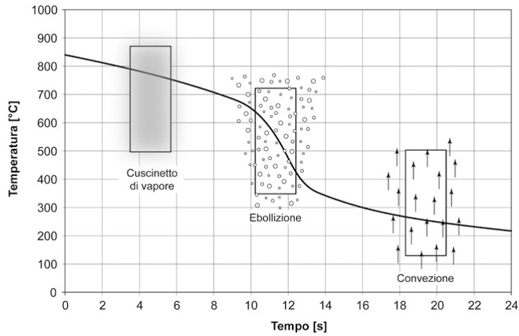
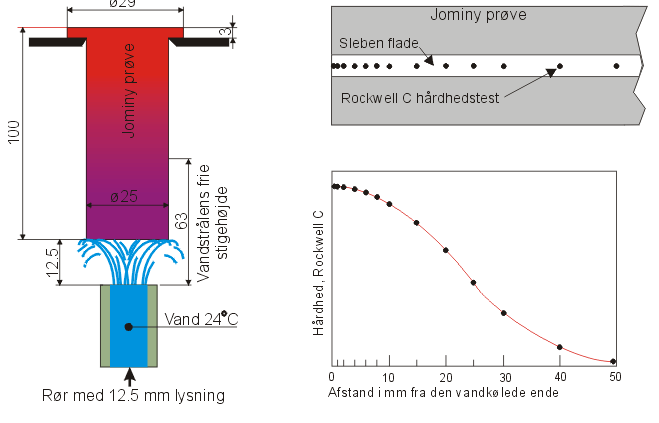

# TEMPRA

In un processo di tempra per avere una struttura completamente martensitica si deve avere:
- la T di riscaldamento del mat e il tempo di permanenza devono essere tali da permettere la completa trasformazione austenitica
- la velocità di raffreddamento deve essere sufficientemente elevata da evitare trasformazioni intermedie
- Mf > T ambiente

Il meccanismo di raffreddamento per tempra è composto da 3 fasi:
1. Inizialmente il liquido evapora in modo istantaneo e forma uno strato stabile di vapore attorno al componente che impedisce al liquido di bollire rapidamente e induce una velocità di raffreddamento molto bassa poiché lo scambio termico è mediato da una fase gassosa. 
2. Scendendo di temperatura lo strato di vapore diviene instabile. Sulla superficie del componente iniziano a generarsi bolle di vapore e nuovo liquido entra in contatto col pezzo caldo per essere immediatamente vaporizzato. I violenti fenomeni convettivi che si instaurano a causa dell’ebollizione consentono di ottenere velocità di raffreddamento estremamente elevate.
3. Il componente sarà stabilmente in contatto con il fluido che non evaporerà più. In questa fase lo scambio termico procede per convezione tra un liquido e un solido e la legge di raffreddamento torna ad essere nuovamente blanda. 

### Temprabilità

**L'attitudine** di un acciaio ad avere una struttura **martensitica** e quindi ad accrescere la sua durezza a seguito della tempra. 
Essa si esprime mediante la **profondità** a cui arriva l'indurimento o profondità dello stato temprato generalmente indica la distanza dalla zona con 50% martensite e 50% perlite.

La profondità di tempra dipende da:
- composizione chimica
- dimensione della grana 
- entità del processo di tempra
- dimensioni del provino

### Prova Jominy

E' utilizzata per capire la temprabilità di un materiale.

1. Si va a sagomare il pezzo in modo opportuno secondo gli standard della prova 
2. Austenizzazione del pezzo 
3. inserimento nell'apposito macchinario 
4. Raffreddare, mediante un getto d'acqua, l'estremità di un tondo dell'acciaio da esaminare portato alla T di tempra.
5. Viene retificato di uno spessore di circa 0,4% di spessore in cui si formano gli ossidi che nella successiva prova di durezza darebbero valori assai superiori
6. Si determina la durezza HRc (Rockwell C) lasciando uno spazio tra le varie prove di circa 1,5 mm
7. Si riportano i valori trovati in un diagramma durezza HRc - distanza dalla parete
8. E' possibile correlarle ai grafici TTT e si avrà che in corrispondenza del punto di flesso della curva si ha il 50% di martensite

### Tempra Bainitica
La tempra bainitica è un processo di trattamento termico per metalli ferrosi a medio-alto contenuto di carbonio che consente di ottenere una struttura metallurgica denominata bainite. Viene usata per aumentare resistenza, solidità e deformazione ridotta.

1. Austenizzazione
2. Raffreddamento con velocità opportuna da evitare la formazione di perlite
3. Mi trovo quindi nel campo di trasformazione in bainite, posso avere:
* ISOTERMICA : permanenza a T costante fino a completa trasformazione
* INTERMEDIA : permanenza a T costante fino a parziale trasformazione
* PARZIALE   : raffreddamento lento sino a fase intermedia sufficientemente progredita

Poi raffreddamento a T ambiente.

